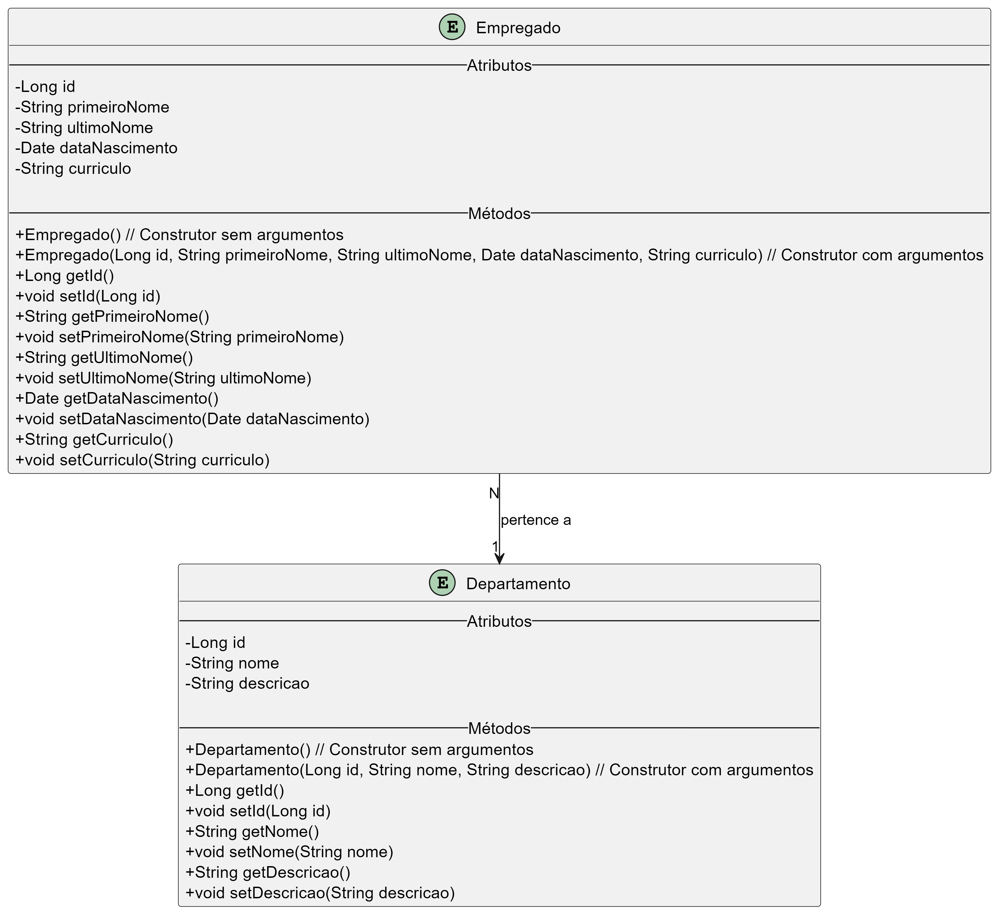

# Projeto Spring Boot

## Descrição
Este projeto foi desenvolvido como parte da aula de Arquitetura de Aplicação Web, utilizando o framework Spring Boot. O objetivo principal foi demonstrar a criação de uma aplicação CRUD com as entidades **Departamento** e **Empregado**, além de um exemplo de "Hello World" para introduzir o uso do Spring Boot.

## Tecnologias Utilizadas
- **Spring Boot**: Framework para simplificar o desenvolvimento de aplicações Java.
- **Spring Web**: Para criação de APIs REST.
- **Spring Data JPA**: Para integração com banco de dados utilizando o padrão JPA.
- **Lombok**: Para reduzir a verbosidade do código, gerando automaticamente getters, setters, construtores, etc.
- **Spring DevTools**: Para facilitar o desenvolvimento com recarregamento automático.
- **MariaDB**: Banco de dados relacional utilizado no projeto.

## Estrutura do Projeto
O projeto segue a estrutura padrão do Spring Boot:

- **Controllers**: Contém os controladores responsáveis por expor as APIs REST.
- **Models**: Contém as classes que representam as entidades do banco de dados.
- **Repositories**: Contém as interfaces para acesso ao banco de dados.
- **Services**: Contém a lógica de negócio da aplicação.

## Entidades
### Departamento
Representa um departamento dentro da organização.
- **Atributos**: id, nome, descrição.

### Empregado
Representa um empregado associado a um departamento.
- **Atributos**: id, nome, cargo, departamento.

## Relacionamento Empregado-Departamento

O relacionamento entre as entidades **Empregado** e **Departamento** é representado na imagem abaixo. Este relacionamento é do tipo **muitos-para-um** (Many-to-One), onde:

- Um **Departamento** pode ter vários **Empregados** associados a ele.
- Cada **Empregado** pertence a um único **Departamento**.

Essa estrutura reflete uma organização típica, onde os empregados são agrupados em departamentos específicos.



## Configuração do Banco de Dados
O projeto utiliza o MariaDB como banco de dados. Para facilitar a configuração e execução do MariaDB, recomendamos o uso do [XAMPP](https://www.apachefriends.org/pt_br/index.html), que fornece um ambiente integrado com MariaDB, Apache e outras ferramentas úteis.

### Configurando o XAMPP
1. Baixe e instale o XAMPP a partir do site oficial: [https://www.apachefriends.org/pt_br/index.html](https://www.apachefriends.org/pt_br/index.html).
2. Após a instalação, inicie o painel de controle do XAMPP.
3. Inicie o serviço do **MariaDB** clicando em "Start" ao lado de "MySQL".
4. Configure as credenciais do banco de dados no arquivo `application.properties` ou `application.yaml` do projeto:

```properties
spring.datasource.url=jdbc:mariadb://localhost:3306/seu_banco
spring.datasource.username=seu_usuario
spring.datasource.password=sua_senha
spring.jpa.hibernate.ddl-auto=update
```

## Executando o Projeto
1. Certifique-se de que o MariaDB está em execução no XAMPP.
2. Abra o projeto no **Visual Studio Code**.
3. Certifique-se de que a extensão **Spring Boot Extension Pack** está instalada no VS Code.
4. No painel do **Spring Boot Dashboard**, localize o projeto e clique no botão de "play" para iniciar a aplicação.
5. Acesse a aplicação no navegador ou via ferramentas como Postman em: `http://localhost:8080`.

## Endpoints Principais
### Hello World
- **GET** `/hello`
  - Retorna uma mensagem de "Hello World".

### Departamento
- **GET** `/departments`
  - Lista todos os departamentos.
- **POST** `/departments`
  - Cria um novo departamento.

### Empregado
- **GET** `/employees`
  - Lista todos os empregados.
- **POST** `/employees`
  - Cria um novo empregado.

## Conclusão
Este projeto serve como base para entender os conceitos fundamentais do Spring Boot e como criar uma aplicação CRUD simples com integração a banco de dados. Ele pode ser expandido para incluir mais funcionalidades e entidades conforme necessário.